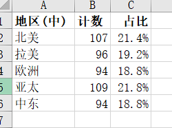
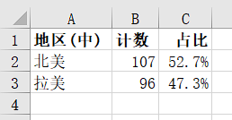
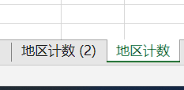
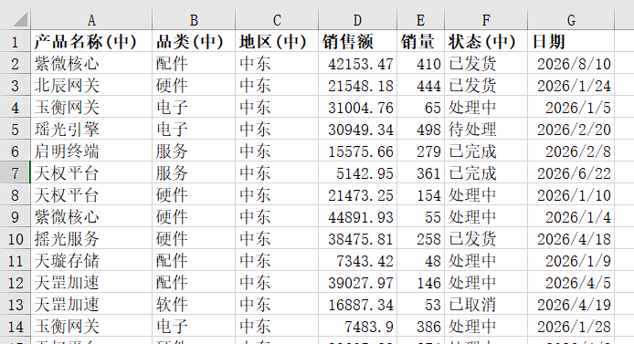
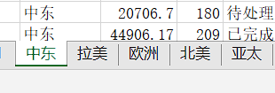
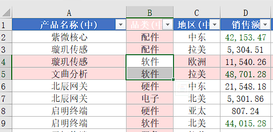

# FUWOA

[English](README/README.en.md)

FUWOA 是一款适用于 Excel 的实用小工具。

## 功能

- **单列计数导出**：选中某一列的标题单元格，将下方所有唯一值及其出现次数导出到新工作表。支持按数值/标题排序、升降序切换、筛选模式下仅统计可见行。可选显示百分比占比列。
- **按列拆分工作表**：按某一列的值将源表拆分为多个独立工作表。
- **视觉工具 - 行列高亮**：高亮当前选中的行和列，方便在大量数据中定位。

## 功能截图

### 导出计数

| 功能区 · 全部 | 功能区 · 已筛选 |
| :-: | :-: |
|  |  |

| 结果 · 全部数据 | 结果 · 已筛选数据 |
| :-: | :-: |
|  |  |

多次导出会生成多个工作表，可重复执行：

### 按列拆分

| 功能区 | 结果 · 明细数据 | 结果 · 分类汇总 |
| :-: | :-: | :-: |
|  |  |  |

### 行列高亮

| 功能区 | 功能展示 |
| :-: | :-: |
|  |  |

## 支持的语言

12 种语言：

简体中文 · 繁體中文 · English · Deutsch · Français · Русский · Tiếng Việt · ไทย · 日本語 · Bahasa Indonesia · བོད་སྐད། · ئۇيغۇرچە

> 语言需在 Excel 插件功能区中手动切换，不会跟随系统语言变化。默认语言为简体中文。部分翻译将在重启 Excel 后生效。

## 系统要求

- Windows 10 / 11（x64）
- Microsoft Office 2016 / 2019 / 2021 / Microsoft 365（桌面版，x64）
- .NET Framework 4.8

> 安装包请到 [Releases](https://github.com/mcuTiger/FUWOA/releases) 页面下载。

## 问题反馈

如有问题或建议，请通过 [GitHub Issues](https://github.com/mcuTiger/FUWOA/issues) 提交。

## 关于

本项目由 [GNU General Public License v3.0](LICENSE) 授权。
