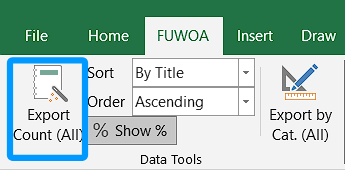
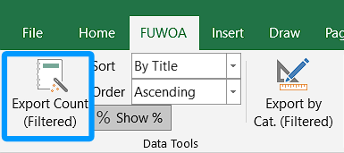
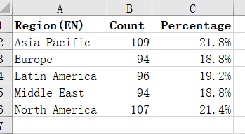
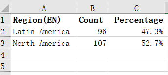
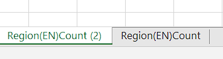
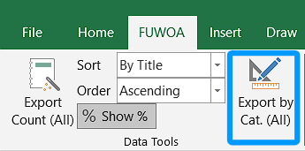
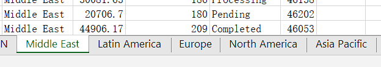
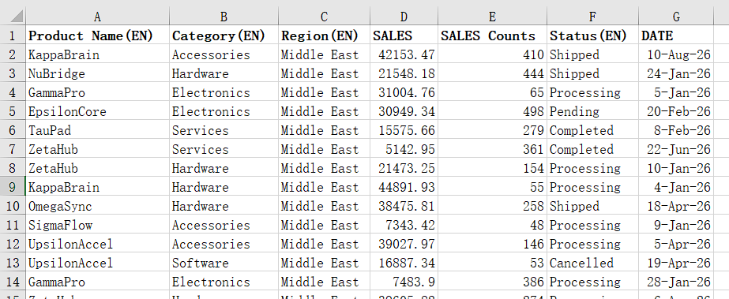
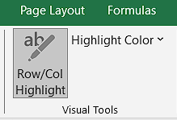
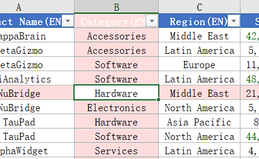

# FUWOA

[中文](../README.md)

FUWOA is a practical utility add-in for Excel.

## Features

- **Single Column Count Export**: Select a header cell in any column to export all unique values and their occurrence counts to a new worksheet. Supports sorting by count/title, ascending/descending order, and visible-rows-only mode when filtered. Optional percentage column.
- **Split Worksheet by Column**: Split the source worksheet into multiple sheets based on values in a column.
- **Visual Tools - Row and column highlighting**: Highlight the currently selected row and column, making it easier to navigate large datasets.

## Screenshots

### Export Count

| Ribbon · All | Ribbon · Filtered |
| :-: | :-: |
|  |  |

| Result · All data | Result · Filtered data |
| :-: | :-: |
|  |  |

Exporting multiple times creates separate worksheets and can be repeated:

### Split by Column

| Ribbon | Result · Detail data | Result · Category summary |
| :-: | :-: | :-: |
|  |  |  |

### Row/Col Highlight

| Ribbon | Demo |
| :-: | :-: |
|  |  |

## Supported Languages

12 languages:

简体中文 · 繁體中文 · English · Deutsch · Français · Русский · Tiếng Việt · ไทย · 日本語 · Bahasa Indonesia · བོད་སྐད། · ئۇيغۇرچە

> Language must be switched manually from the Excel add-in ribbon. It does not follow the system language. Default is Simplified Chinese. Some translations take effect after restarting Excel.

## System Requirements

- Windows 10 / 11 (x64)
- Microsoft Office 2016 / 2019 / 2021 / Microsoft 365 (desktop, x64)
- .NET Framework 4.8

> Download the installer from the [Releases](https://github.com/mcuTiger/FUWOA/releases) page.

## Issues

For bug reports or feature requests, please visit [GitHub Issues](https://github.com/mcuTiger/FUWOA/issues).

## About

This project is licensed under [GNU General Public License v3.0](LICENSE).
